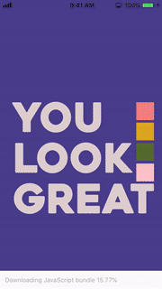

# _You Look Great_

_Currently a Work In Progress. An iOS mobile app that compliments you when you take a selfie.  Functionality is completed, I will be re-recording audio shortly._

## Setup

- Download the expo app on your iOS device. https://apps.apple.com/us/app/expo-client/id982107779
- `npm i` and `expo start` in terminal.
- Scan QR code with your iOS device to launch app on device.

## Demo GIFs

## Dependencies

*"@ptomasroos/react-native-multi-slider": "^1.0.0",*  
*"expo": "^32.0.0",*  
*"native-base": "^2.12.1",*  
*"react": "16.5.0",*  
*"react-native": "https://github.com/expo/react-native/archive/sdk-32.0.0.tar.gz",*  
*"react-native-fade-in-image": "^1.5.0",*  
*"react-native-fetch-blob": "^0.10.8",*  
*"react-native-share": "^1.2.1",*  
*"react-native-swiper": "^1.5.14",*  
*"react-native-switch-toggle": "^1.1.0",*  
*"react-navigation": "^3.11.0"*  

## TODO

[] re-record audio  
[] flip photo on front camera  
[] reset flip after done with preview  
[] hide HUD option
